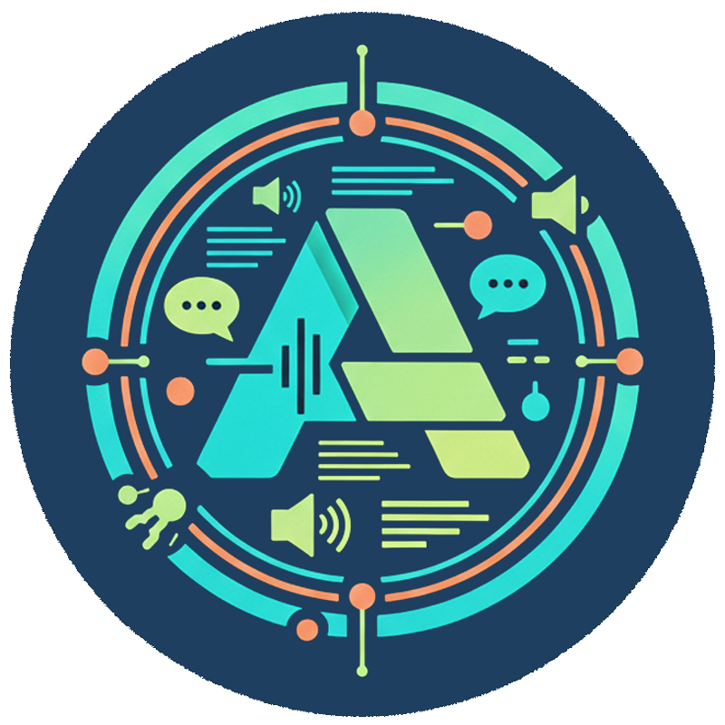

# Phase 2 Session 068 - UI Overhaul: Discovery Quiz & Popup Header

**Date**: 2026-01-28
**Duration**: ~2 hours
**Phase**: Phase 2 Extension - UI Overhaul
**Progress**: UI improvements and branding updates
**Session Number**: 68

---

## Session Overview

**Goal**: Improve Discovery Quiz experience and redesign popup header with new branding
**Status**: Complete

---

## Accomplishments

### 1. Discovery Quiz Improvements

Added Quick Quiz mode and preset recommendations to enhance the onboarding experience.

#### Quick Quiz Mode

- Added quiz mode selector on welcome screen (Quick: 3 questions / Full: 6 questions)
- Quick Quiz uses questions: `reading`, `focus`, `visual` for faster profiling
- State management updated to track `quizMode` and `activeQuestions`

#### Preset Recommendations

Added three preset profiles that can be recommended based on quiz responses:

| Preset            | Icon   | Features Enabled                                                      |
| ----------------- | ------ | --------------------------------------------------------------------- |
| ADHD Focus        | target | Focus Mode, Pomodoro, Reduced Motion, Media Control, Reading Progress |
| Dyslexia Support  | book   | TTS, Dyslexia Mode, Reading Guide, Reading Mode, Text Customization   |
| Sensory Sensitive | moon   | Dark Mode, Screen Overlay, Reduced Motion, Media Control, Focus Mode  |

#### Files Modified

| File                 | Changes                                                   |
| -------------------- | --------------------------------------------------------- |
| `questions.js`       | Added `QUICK_QUIZ_IDS`, `getQuestionsForMode()`           |
| `recommendations.js` | Added `PRESETS`, `calculateBestPreset()`, `applyPreset()` |
| `discovery.js`       | Updated state, quiz mode handlers, preset rendering       |
| `discovery.html`     | Quiz mode selector UI, preset recommendation section      |
| `discovery.css`      | Styles for quiz mode options and preset cards             |

---

### 2. Popup Header Redesign

Redesigned the popup header with new logo, branding, and layout.

#### Changes Made

1. **Header Structure**: Split into `.header-brand` (logo + title) and `.header-actions` (buttons)
2. **Logo**: Added AssisT logo image (36x36px)
3. **Background Color**: Changed to `#223b56` (navy blue matching logo)
4. **Button Layout**: Buttons now in a centered row below the subtitle
5. **Typography**: White text on dark background

#### HTML Structure

```html
<header class="popup-header">
  <div class="header-brand">
    
    <h1 class="header-title">AssisT</h1>
  </div>
  <p class="subtitle">Learning Support Tools</p>
  <div class="header-actions">
    <!-- Reset, Help, Options, Organize buttons -->
  </div>
</header>
```

---

### 3. Logo & Icon Update

Updated all extension icons to use new AssisTCircleAlpha.png with transparency.

#### Steps Taken

1. Copied `Ident/AssisTCircleAlpha.png` to `public/icons/assist-logo.png`
2. Generated icon sizes using FFmpeg:
   - `icon16.png` (16x16)
   - `icon32.png` (32x32)
   - `icon48.png` (48x48)
   - `icon128.png` (128x128)
3. Updated `manifest.json` web_accessible_resources to include `public/icons/*`
4. Updated popup.html to reference PNG instead of JPG

---

## Commits Made

| Commit    | Message                                                               |
| --------- | --------------------------------------------------------------------- |
| `a6d628c` | feat(ui): add Quick Quiz mode and preset recommendations to discovery |
| `83e5a56` | feat(ui): redesign popup header with logo and centered button row     |
| `76e4f3b` | feat(ui): update logo to AssisTCircleAlpha with transparency          |

---

## Issues Encountered & Resolved

### 1. Commit Scope Validation

- **Issue**: Commit scope "discovery" not in allowed list
- **Fix**: Used "ui" scope instead for discovery changes

### 2. Logo Image Path

- **Issue**: Logo not displaying in popup (wrong path)
- **Fix**: Used `../../public/icons/` from `src/popup/popup.html`

### 3. Logo Not in Build Output

- **Issue**: Logo file not being copied to `.vite/` build directory
- **Fix**: Added `public/icons/*` to manifest.json `web_accessible_resources`

### 4. Bash Line Continuation

- **Issue**: Backslash line continuation not working in Windows bash
- **Fix**: Ran FFmpeg commands separately instead of chained

---

## Next Steps

- Continue UI overhaul tasks per plan
- Test Discovery Quiz in browser
- Verify new icons appear correctly in Chrome extension toolbar

---

## Build Status

- **npm run build**: Successful
- **Extension loads**: Yes
- **New icons visible**: Yes (requires Chrome extension reload)
